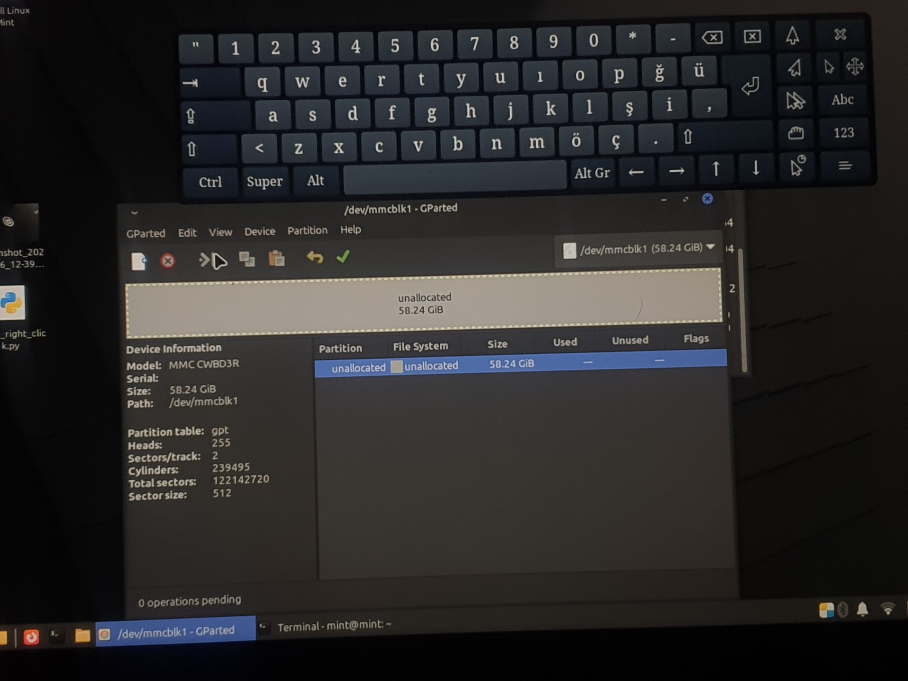

# Bölüm I: Onarım ve Diriliş

Her şey, başarısız bir işletim sistemi (Brunch OS) kurulum denemesinin ardından başladı. Tablet, açılışta ne Windows'u başlatabiliyor ne de kuruluma devam edebiliyordu; sürekli olarak "Otomatik Onarım" döngüsüne giriyor veya doğrudan UEFI Shell ekranına düşüyordu. Cihaz, yazılımsal olarak "brick" olmuş, işlevsiz bir hale gelmişti.

## Arıza Tespiti: Kanıta Dayalı Sistematik Yaklaşım

Sorunun kaynağını bulmak için basit ama etkili bir yöntem izledim: Donanımı, işletim sistemi çekirdeği ve aygıtın kendi firmware'i olmak üzere iki farklı seviyede test etmek.

| **Seviye 1: Linux Çekirdeği ile Donanım Testi** | **Seviye 2: UEFI Firmware ile Aygıt Testi** |
| :---: | :---: |
| Bir Linux Mint Live USB'si ile sistemi başlattığımda, `GParted` uygulaması tabletin 64GB'lık eMMC depolamasını sorunsuz bir şekilde tanıdı. Üzerinde bölümleme yapabiliyor, formatlayabiliyordum. Bu, depolama çipinin fiziksel olarak sağlam olduğunun kesin ve net bir kanıtıydı. | UEFI Shell ekranında ise, aygıtları listeleyen `map -r` komutu, eMMC depolama birimine ait hiçbir girdi (`blkX`) göstermiyordu. Bu durum, tabletin kendi beyni olan UEFI'nin, fiziksel olarak sağlam olan belleği donanım seviyesinde tanıyamadığını ortaya koyuyordu. |
|  |  |
| *GParted, eMMC çipinin yaşadığını söylüyordu. Sorun donanımsal değildi.* | *`map -r` komutu, UEFI'nin aynı belleği göremediğini kanıtlıyordu.* |

**Nihai Teşhis:** Bu iki testin sonucu çelişkili gibi görünse de aslında sorunu tam olarak işaret ediyordu: Problem, eMMC çipinin kendisinde değil, UEFI firmware'inde veya NVRAM'deki bir yapılandırma bozulmasındaydı. Başarısız kurulum, aygıtın kendi donanımını tanımasını sağlayan yazılım katmanını bozmuştu.

## Çözüm: Tek Port Kısıtlamasını Aşmak

Bu net kanıtlarla durumu Wortmann AG teknik desteğine ilettiğimde, sorunun bilinen bir durum olduğunu ve çözümün BIOS'un yeniden flash'lanması olduğunu teyit ettiler. Gerekli BIOS dosyasını ve talimatları paylaştılar.

Ancak ortada ciddi bir donanımsal kısıtlama vardı: Cihazdaki **tek bir USB portu**. Flash'lama işlemi için hem komutları yazacak bir USB klavyeye hem de dosyaları tutan bir USB belleğe aynı anda ihtiyaç vardı.

Bu sorunu aşmak için aşağıdaki adımları izleyen bir yöntem geliştirdim:

1.  **Komutu Hafızaya Almak:** Önce USB klavyeyi taktım. EFI Shell'e `Flash.nsh` komutunu yazıp (hata vermesini önemsemeden) Enter'a bastım. Bu, komutu Shell'in geçici geçmiş hafızasına kaydetti.
2.  **Cihazları Değiştirmek:** Klavyeyi çıkarıp, içinde BIOS dosyaları olan USB belleği taktım.
3.  **Komutu Geri Çağırmak:** Klavye olmadan, tabletin fiziksel **Ses Açma/Kısma tuşlarını** kullanarak komut geçmişinde gezindim. `Flash.nsh` komutu ekranda yeniden belirdiğinde, **Güç Tuşuna** bir kez basarak (Enter işlevi görür) komutu çalıştırdım.

Bu alışılmadık yöntem sayesinde flash'lama işlemi başarıyla tamamlandı ve tabletin beyni, unuttuğu belleğini yeniden tanıdı. Cihaz, bu operasyonla komadan çıkmış ve yeniden hayata dönmüştü.

### Gerekli Dosyalar

*   **Terra Pad 1062 BIOS Dosyası:** Üreticinin sağladığı BIOS flash dosyasına aşağıdaki linkten ulaşabilirsiniz.
    *   [TERRAPAD1062_BIOS_FLASH.zip İndirme Linki](../TERRAPAD1062_BIOS_FLASH.zip)
    *   **Uyarı:** BIOS güncellemesi riskli bir işlemdir. Bu dosyayı kullanmanın tüm sorumluluğu size aittir. İşlem sırasında cihazın gücünün kesilmediğinden emin olun.

---
**[Sıradaki Bölüm: Donanımsal Evrim →](./2_Hardware_Evolution.md)**
