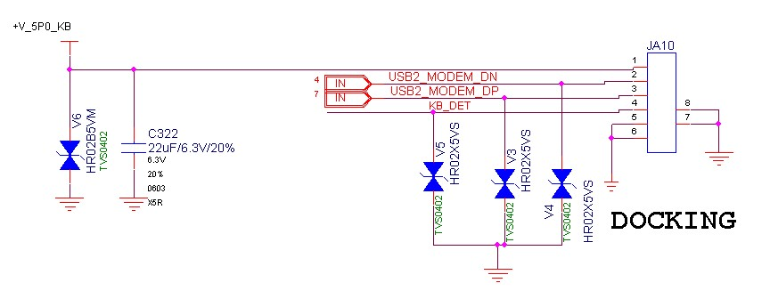

# Bölüm II: Sırları Çözmek - Kayıp Docking Portunun Haritası

Tablet yeniden hayattaydı, ama potansiyelinin tamamı kilitliydi. Gözüm, tabletin altındaki, orijinal klavyesi için tasarlanmış gizemli 5 pinli manyetik konnektöre takıldı. Bu port sadece bir klavye bağlantısı mıydı, yoksa daha fazlasını mı vaat ediyordu? Bu merak, projenin ikinci ve en heyecanlı aşamasını başlattı.

## Görev: Pinlerin Haritasını Çıkarmak

Bu portun sırrını çözmek için iki yönlü bir strateji izledim: Dijital ve Fiziksel.

1.  **Dijital Keşif:** Üretici Wortmann AG ile kurduğum teması devam ettirerek, portun teknik bir şemasını rica ettim. Şans eseri, projeye olan ilgimden etkilenerek bana portun bağlantılarını gösteren bir şema parçası gönderdiler. Bu, bulmacanın ilk ve en önemli parçasıydı.
2.  **Fiziksel Doğrulama:** Bir multimetre ile, şemadaki her bir pinin işlevini fiziksel olarak test ettim. Voltaj ölçümleriyle +5V ve GND pinlerini, süreklilik testiyle de USB data hatlarını doğruladım.

*^Üreticinin sağladığı ve macerayı başlatan o şema.*

*^Şema ve multimetre ölçümleriyle doğruladığım, artık sırrı kalmamış pin yapısı.*

### Deşifre Edilmiş Pin Yapısı (Soldan Sağa)

Bu analizler sonucunda, portun aslında tam işlevli bir USB 2.0 portu barındırdığı kesinleşti:

| Pin No | İşlevi                | Şema Karşılığı | Açıklama                                                                |
| :----: | ------------------- | :------------: | ----------------------------------------------------------------------- |
| **1**  | **+5V Güç**         |  `+V_5P0_KB`   | Harici aksesuarlara güç sağlar. USB standartlarına uygun.                 |
| **2**  | **USB Data - (DN)** | `USB2_MODEM_DN`| Standart USB 2.0 negatif veri hattı.                                    |
| **3**  | **USB Data + (DP)** | `USB2_MODEM_DP`| Standart USB 2.0 pozitif veri hattı.                                    |
| **4**  | **Klavye Algılama** |    `KB_DET`    | Klavye takılı olup olmadığını algılar. Toprağa (GND) çekilince aktif olur. |
| **5**  | **Toprak (GND)**    |     `GND`      | Devre için ortak referans topraklaması.                                   |

## İcat: Cihaza Yeni Bir Organ Eklemek

Bu bilgi, altın değerindeydi. Artık tablete, kasasını delmeden veya mevcut portlarını meşgul etmeden yepyeni bir USB portu ekleyebilirdim. Pogo pinler ve standart bir USB-A dişi portu kullanarak, bu özel porta tam oturan ve cihaza ikinci bir USB girişi kazandıran bir adaptör tasarlayıp lehimledim.

Artık bu port üzerinden harici diskler, fareler, klavyeler ve hatta USB Hub'lar bağlayarak tabletin yeteneklerini bir anda katlamak mümkündü.

*^Pogo pinler ve bir USB dişi portu kullanılarak yapılmış, tablete yeni yetenekler kazandıran özel adaptör.*
