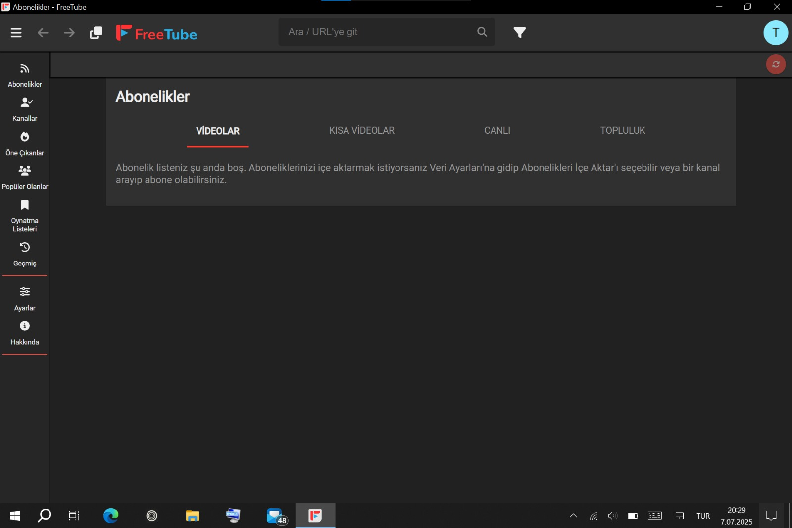

# Bölüm III: Yazılım ve Optimizasyon

Donanım modifikasyonları tamamlandıktan sonraki aşama, bu donanıma en uygun yazılım ekosistemini kurmak ve onu verimli bir iş istasyonuna dönüştürmekti.

## A. İşletim Sistemi Arayışı: İdealler ve Gerçekler

*   **Problem:** Intel Atom Z8500 gibi düşük güçlü bir işlemci, modern işletim sistemleri altında kolayca zorlanabilir. Amacım, hem medya tüketimi hem de üretkenlik için en akıcı deneyimi bulmaktı.
*   **Deneyler ve Sonuçlar:**
    *   **Ubuntu:** Kurulum sırasında ekranın sürekli kapanması, kurulumu tamamlamayı imkansız hale getirdi.
    *   **Debian (Net Install):** Çift işletim sistemi amacıyla minimal bir kurulum denedim. Ancak sonuç, Windows 10'a kıyasla son derece yavaş ve tablet kullanımından uzak, verimsiz bir deneyim oldu.
*   **Nihai Karar:** Yapılan testler, bu özel donanım kombinasyonu için en stabil, uyumlu ve performanslı platformun **Windows 10** olduğunu kesinleştirdi. Özellikle dokunmatik ekran, kalem ve sensör sürücüleri konusundaki sorunsuz entegrasyon belirleyici oldu.

  

  <i>Linux dünyasındaki sayısız denemeden sadece biri. Her dağıtım, donanım uyumluluğu konusunda farklı bir sınav verdi.</i>

## B. Kritik Yazılım Seçimleri ve İpuçları

Bu donanımda en iyi çalışan ve tableti gerçek bir taşınabilir iş istasyonuna dönüştüren, **hızlı açılan ve stabil kullanım sağlayan** yazılımlar şunlar oldu:

#### Kodlama ve Metin Düzenleme: **Sublime Text**
İnanılmaz derecede hafif yapısı sayesinde anında açılıyor ve en büyük kod dosyalarında bile takılmadan, akıcı bir kullanım sunuyor. Düşük güçlü sistemler için mükemmel bir seçim.

#### PDF Görüntüleme ve Düzenleme: **PDF-XChange Editor**
Adobe Reader gibi ağır alternatiflerin aksine, çok hızlı açılıyor ve büyük PDF'lerde gezinirken bile kasmadan stabil bir performans sergiliyor. Kapsamlı düzenleme özellikleri de cabası.

#### Ofis Uygulamaları: **SoftMaker FreeOffice**
Microsoft Office'e en hızlı ve en hafif alternatif. Word, Excel ve PowerPoint dosyalarını şaşırtıcı bir hızla açıyor ve düzenliyor.

#### E-Posta İstemcisi: **Wino Mail**
Modern ve temiz arayüzünü, sistem kaynaklarını tüketmeyen hafif bir yapıyla birleştiriyor.

  

  <i>Cihazın potansiyelini ortaya çıkaran hafif ve güçlü yazılımlar.</i>

## C. Günlük Kullanım Optimizasyonları

#### YouTube Sorunu ve Çözümü: **FreeTube**
*   **Problem:** En optimize tarayıcılarla bile, tarayıcıdan YouTube içeriği tüketmek imkansızdı. Sürekli takılmalar, yavaşlık, ses ve görüntü kaymaları yaşanıyordu.
*   **Çözüm:** Tarayıcıyı aradan çıkaran **FreeTube** istemcisi kuruldu.
*   **Sonuç:** Sıfır takılma, reklamsız ve akıcı bir YouTube deneyimi elde edildi. Bu tek uygulama, tabletin medya tüketim kabiliyetini tamamen değiştirdi.

  

  <i>FreeTube, düşük güçlü donanımda YouTube'u yeniden keyifli hale getiriyor.</i>

#### Tarayıcı ve Dokunmatik İpuçları
*   **En Hızlı Tarayıcı:** Denediğim tüm tarayıcılar arasında en akıcı ve hızlı çalışan **Microsoft Edge** oldu.
*   **Dokunmatik Sorunu ve Çözümü:** Chromium tabanlı tarayıcılarda, yeni sekme açma gibi butonlara dokunmatik ile tıklandığında yaşanan yanlış tıklama sorununu, butona kısa bir süre **basılı tutarak** çözdüm.

#### OneNote ve Kalem Çözümü
*   **En Hızlı Versiyon:** `OneNote for Windows 10` (Microsoft Store versiyonu), diğer tüm versiyonlardan çok daha akıcı ve hızlı çalıştı.
*   **Kalem Sorunu ve Çözümü:** Cihazın orijinal kalemi bulunmadığı için, `VirtualTablet` uygulamasını kullanarak kendi telefonumu bir grafik tablet olarak bilgisayara bağladım ve telefonun kalemini kullandım.
*   **Bilinen Sorun:** OneNote'un bu versiyonu, bazı büyük PDF dosyalarını açarken "printout" hatası verebiliyor.

  

  <i>Doğru OneNote versiyonu ve VirtualTablet ile akıcı bir not alma deneyimi.</i>

Bu yazılımlar sayesinde tablet, donanımının getirdiği tüm dezavantajların aşıldığı, tam teşekküllü bir taşınabilir Windows sistemine dönüştü.

---
**[Sıradaki Bölüm: Sınırların Ötesi - Yeni Yetenekler →](./4_Beyond_The_Limits.md)**
