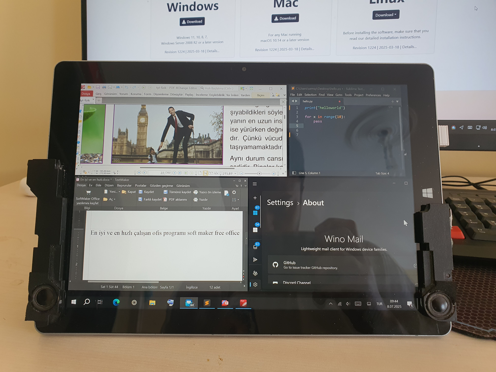

# Bölüm III: Yazılım ve Optimizasyon

Donanım modifikasyonları tamamlandıktan sonraki aşama, bu donanıma en uygun yazılım ekosistemini kurmak ve onu verimli bir iş istasyonuna dönüştürmekti.

## A. İşletim Sistemi Arayışı: İdealler ve Gerçekler

*   **Problem:** Intel Atom Z8500 gibi düşük güçlü bir işlemci, modern işletim sistemleri altında kolayca zorlanabilir. Amacım, hem medya tüketimi hem de üretkenlik için en akıcı deneyimi sunan sistemi bulmaktı.
*   **Deneyler ve Sonuçlar:**
    *   **Ubuntu:** Kurulum sırasında ekranın sürekli kapanması, kurulumu tamamlamayı imkansız hale getirdi.
    *   **Debian (Net Install):** Çift işletim sistemi amacıyla minimal bir kurulum denedim. Ancak sonuç, Windows 10'a kıyasla son derece yavaş ve tablet kullanımından uzak, verimsiz bir deneyim oldu.
*   **Nihai Karar:** Yapılan testler, bu özel donanım kombinasyonu için en stabil, uyumlu ve performanslı platformun **Windows 10** olduğunu kesinleştirdi. Özellikle dokunmatik ekran, kalem ve sensör sürücüleri konusundaki sorunsuz entegrasyon belirleyici oldu.

  <i>Linux dünyasındaki sayısız denemeden sadece biri. Her dağıtım, donanım uyumluluğu konusunda farklı bir sınav verdi.</i>

## B. Kritik Yazılım Seçimleri ve İpuçları

Bu donanımda en iyi çalışan ve tableti gerçek bir taşınabilir iş istasyonuna dönüştüren yazılımlar şunlar oldu:

| Kategori | Seçilen Yazılım | Neden? |
| :--- | :--- | :--- |
| **Kodlama** | Sublime Text | İnanılmaz derecede hafif, hızlı ve anında açılıyor. Düşük güçlü sistemler için mükemmel. |
| **PDF** | PDF-XChange Editor | Diğer okuyuculara göre çok daha hızlı çalışıyor ve kapsamlı düzenleme özellikleri sunuyor. |
| **Ofis** | SoftMaker FreeOffice | Microsoft Office'e en hızlı ve en hafif alternatif. Belgeleri anında açıyor. |
| **E-Posta**| Wino Mail | Modern arayüzü ve hafif yapısıyla sistem kaynaklarını tüketmiyor. |

  <i>Cihazın potansiyelini ortaya çıkaran hafif ve güçlü yazılımlar.</i>

## C. Günlük Kullanım Optimizasyonları

*   **YouTube Sorunu ve Çözümü:**
    *   **Problem:** En optimize tarayıcılarla bile, tarayıcıdan YouTube içeriği tüketmek imkansızdı. Sürekli takılmalar, yavaşlık, ses ve görüntü kaymaları yaşanıyordu. Film izlemede sorun olmasa da YouTube, cihazın Aşil topuğuydu.
    *   **Çözüm:** Tarayıcıyı aradan çıkaran **FreeTube** istemcisi oldu.
    *   **Sonuç:** Sıfır takılma, reklamsız ve akıcı bir YouTube deneyimi elde edildi.

*   **Tarayıcı Optimizasyonu:**
    *   **En Hızlı Tarayıcı:** Denediğim tüm tarayıcılar arasında en akıcı ve hızlı çalışan **Microsoft Edge** oldu.
    *   **Dokunmatik Sorunu ve Çözümü:** Chromium tabanlı tarayıcılarda, yeni sekme açma gibi butonlara dokunmatik ile tıklandığında, tarayıcı konumu tam teşhis edemeyip farklı bir sekmeyi kapatabiliyordu. **Çözüm:** Butona tıklamak yerine kısa bir süre **basılı tutarak** tarayıcının doğru konumu algılamasını sağlamak oldu.

*   **OneNote Performansı ve Kalem Çözümü:**
    *   **En Hızlı Versiyon:** `OneNote for Windows 10` (Microsoft Store versiyonu), diğer tüm PDF okuyuculardan ve OneNote versiyonlarından çok daha akıcı ve hızlı çalıştı.
    *   **Kalem Sorunu ve Çözümü:** Cihazın orijinal kalemi bulunmadığı için, `VirtualTablet` uygulamasını kullanarak kendi telefonumu bir grafik tablet olarak bilgisayara bağladım ve telefonun kalemini kullandım. Bu kombinasyon, OneNote'ta süper hızlı ve akışkan bir çizim/not alma deneyimi sağladı.
    *   **Bilinen Sorun:** OneNote'un bu versiyonu, bazı büyük PDF dosyalarını açarken "printout" hatası verebiliyor. Bu soruna henüz bir çözüm bulunamadı.

Bu yazılımlar sayesinde tablet, donanımının getirdiği tüm dezavantajların aşıldığı; kütüphanede, kafede veya yolda ofis işlerimi yapabildiğim, kodlarımı inceleyebildiğim, medya tüketebildiğim tam teşekküllü bir taşınabilir Windows sistemine dönüştü.

---
**[Sıradaki Bölüm: Sınırların Ötesi - Yeni Yetenekler →](./4_Beyond_The_Limits.md)**
