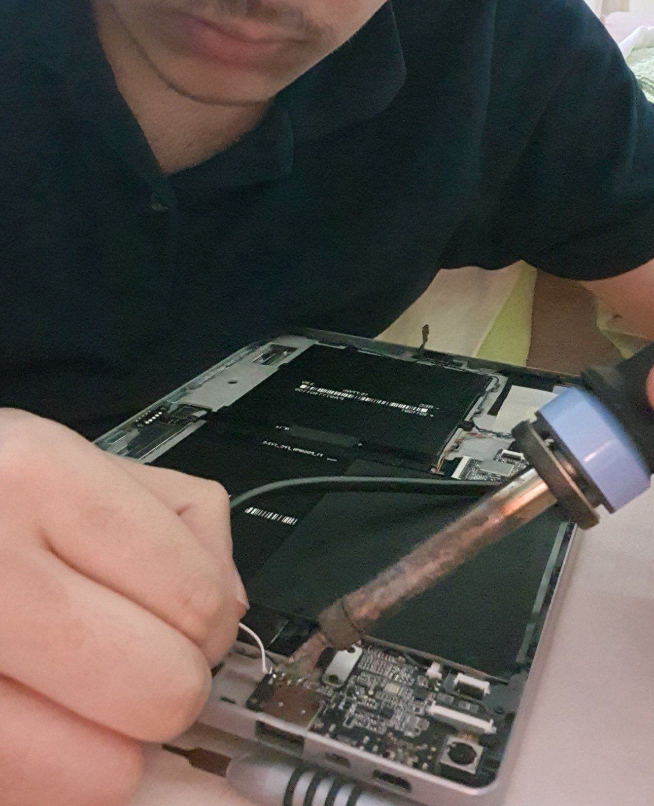

# Bölüm III: Donanımsal Evrim

Bir cihazı onarmak onu standartlarına döndürür. Onu evrimleştirmek ise potansiyelini ortaya çıkarmaktır. Bu bölümde, tabletin zayıf noktalarını güçlendiren ve onu daha kullanışlı hale getiren modifikasyonlar yer almaktadır.

### Modifikasyon 1: Ses Sistemi Yükseltmesi

*   **Problem:** Cihazın orijinal hoparlörleri, cılız, tiz ve yetersiz bir ses kalitesi sunuyordu.
*   **Çözüm:** Eski bir dizüstü bilgisayardan söktüğüm, çok daha kaliteli ve dolgun ses veren bir çift hoparlörü, tabletin orijinal hoparlör çıkışlarına lehimledim.
*   **Mühendislik Detayı:** Buradaki en kritik nokta, hoparlörlerin kasa içindeki yerleşimiydi. Hoparlörleri, kasa geometrisine **sıfıra sıfır** oturacak ve diğer bileşenlere temas etmeyecek şekilde konumlandırdım. Bu hassas yerleşim sayesinde, kasa kapatıldığında ne ekrana bir baskı oluşuyor ne de tableti elde tutarken dışarıdan bir çıkıntı hissediliyordu. Ses kalitesi artarken, cihazın ergonomisi ve bütünlüğü korundu.

*^Yeni hoparlörlerin lehimlenmesi.*

### Modifikasyon 2: "Hayalet Klavye" Sorununun Çözümü

*   **Problem:** Kendi yaptığım docking portu adaptörünü test ederken, tabletin zaman zaman ortada klavye yokken varmış gibi davrandığını fark ettim. Bu durum, otomatik ekran döndürmeyi kilitliyor ve sanal klavyenin açılmasını engelliyordu.
*   **Arıza Tespiti:** Birkaç gözlemden sonra sorunun kaynağını buldum: Yaptığım özel soketin lehimlenmiş metal pinleri, tabletin alüminyum şasesine temas ederek `KB_DET` (Klavye Algılama) pinini istem dışı olarak toprağa çekiyordu.
*   **Çözüm:** Temas eden bölgeyi sıcak silikon ile tamamen yalıtarak bu sorunu kalıcı olarak çözdüm. Bu, özellikle metal kasalı cihazlarda yapılan modifikasyonlarda yalıtımın ne kadar kritik olduğunu gösteren bir tecrübe oldu.

### Diğer Mekanik İyileştirmeler

*   **Kamera Lensi Değişimi:** Çizik olan orijinal kamera lensi, eski bir laptoptan dikkatlice sökülen sağlam bir lens ile değiştirildi. Lens, yapışkanına zarar vermemek için etrafındaki plastikten kırılarak dikkatlice ayrıldı.
*   **Şase Gıcırdamasının Giderilmesi:** Kasanın esneyen ve gıcırdama yapan noktalarına, iç kısımdan küçük destek parçaları eklenerek cihazın mekanik bütünlüğü artırıldı ve ses sorunu giderildi.

*^Tüm modifikasyonlar tamamlandıktan sonra tabletin iç düzeni.*
