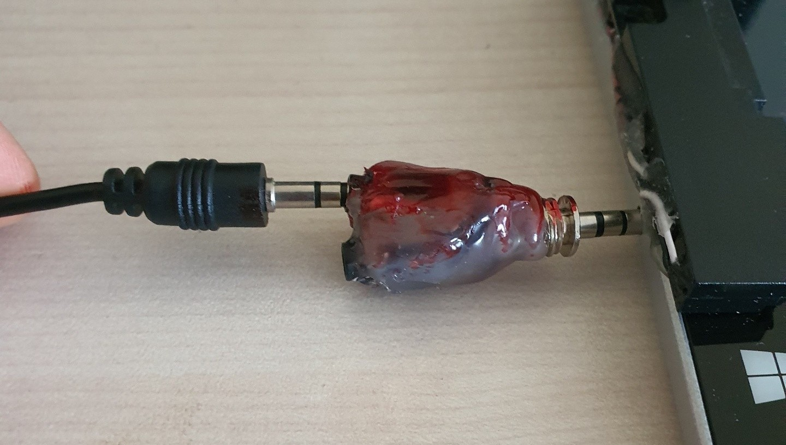
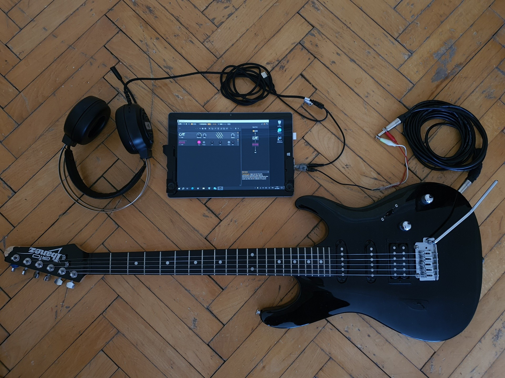
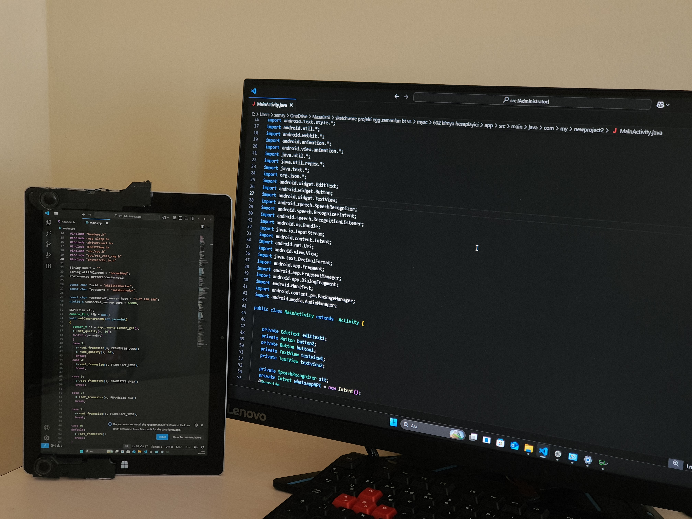

# Bölüm IV: Sınırların Ötesi - Bir Tabletten Daha Fazlası

Bu proje sadece bir onarım hikayesi değil, aynı zamanda yaratıcılıkla bir cihazın ne kadar çok yönlü olabileceğinin bir kanıtıdır. Onarılan ve optimize edilen bu tablet, artık standart bir cihazın çok ötesinde, kişisel ihtiyaçlarıma göre şekillenmiş bir dizi araca dönüştü.

## 🎸 Senaryo 1: Gecikmesiz ve Taşınabilir Gitar Stüdyosu

*   **Problem:** Bir elektro gitarı doğrudan bir Windows bilgisayara bağladığınızda, ses sürücülerinin yarattığı yüksek gecikme (latency), çalmayı imkansız hale getirir. Bu sorunu çözmek için satılan harici ses kartları ise hem pahalı hem de taşınabilirliğe engeldir.
*   **Çözüm:** Bu sorunu, donanım ve yazılımı birleştiren, çok daha ucuz ve taşınabilir bir yöntemle aştım:
    1.  **Donanım:** Bir ucu gitar girişi (kırmızı), diğer ucu kulaklık/hoparlör çıkışı olan özel yapım bir **AUX splitter** aparatı hazırladım. Bu basit ama etkili aparat, gitar sinyalini mikrofona, dinleme sesini ise kulaklığa doğru yönlendirir.
    2.  **Yazılım (Sürücü):** Standart ASIO4ALL sürücüsü yerine, çok daha esnek ve donanımı daha iyi tespit edebilen **[FlexASIO](https://github.com/dechamps/FlexASIO)** sürücüsünü kurdum. FlexASIO'nun GUI (Grafiksel Kullanıcı Arayüzü) aracı, ses giriş ve çıkışlarını kolayca yönetme imkanı tanır.
    3.  **Yazılım (Prosesör):** **Guitar Rig 7** programı ile, tableti tam teşekküllü bir amfi ve efekt prosesörüne dönüştürdüm.
*   **Sonuç:** Bu kurulum sayesinde, sıfıra yakın bir gecikmeyle, istediğim yerde elektro gitarıma sayısız ton ve efekt katabiliyorum. Windows tabanlı olmasının getirdiği bu esneklik, tableti bir müzik aletine dönüştürdü.

  

  <i>1. Fotoğraf: Özel yapım AUX splitter (kırmızı uç gitar girişi).</i>

  

  <i>2. Fotoğraf: Tablet, gitar, kulaklık ve splitter ile tüm sistemin çalışır hali.</i>

## 💻 Senaryo 2: Kablosuz ve Dokunmatik Kodlama Monitörü

*   **Problem:** Kodlama yaparken genellikle referans dokümanları, terminal çıktıları veya çalışan uygulamayı görmek için ikinci bir ekrana ihtiyaç duyarım.
*   **Çözüm:** **[Space Desk](https://www.spacedesk.net/)** programı, tableti kablosuz olarak ana bilgisayarımın ikinci bir monitörüne dönüştürdü. Bu, bana inanılmaz bir esneklik ve hız kattı.
*   **Kullanım Farkı:** Bu kurulumun en büyük avantajı, tabletin dokunmatik özelliğinin korunması. Ana ekranda kod yazarken, tabletteki referans kodlar arasında parmağımla kaydırma yapabilmek veya bir hata mesajını direkt üzerine dokunarak seçebilmek, iş akışımı inanılmaz derecede hızlandırdı.
*   **Pro İpucu:** Tableti dikey modda verimli kullanmak için izlenmesi gereken adımlar şunlardır: Önce tabletin kendi ayarlarından otomatik döndürmeyi kapatın. Ardından Space Desk ile bilgisayara bağlanın. Ekran yatay geldiğinde, ana bilgisayarınızın Görüntü Ayarları'ndan ikinci monitörün yönünü "Dikey" olarak seçin. Bu sayede dikey kodlama için mükemmel bir yardımcı ekranınız olur.

  

  <i>Kodlama yaparken sağladığı dokunmatik ve dikey ikinci ekran alanı ile verimliliği artıran bir kurulum.</i>

## ⚡ Senaryo 3: Mobil Mühendislik Laboratuvarı (Proteus 8)

*   **Sürpriz:** Bu projenin en şaşırtıcı sonuçlarından biri, normalde kaynak tüketimiyle bilinen profesyonel bir elektronik devre simülasyon programı olan **Proteus 8**'in bu tablette çalışabilmesiydi.
*   **Kullanım Alanı:** Bu, tableti, aklıma takılan bir devre fikrini kütüphanede veya bir kafede hızlıca kurup test edebileceğim, temel simülasyonları yapabileceğim bir "mobil laboratuvara" dönüştürdü. Ağır projeler için olmasa da, anlık fikirleri görselleştirmek ve denemek için paha biçilmez bir yetenek.

### Sonuç: Yaratıcılığın Donanıma Üstünlüğü

Bu proje, eski bir donanımın bile doğru yaklaşımla, akıllı yazılım seçimleriyle ve biraz yaratıcılıkla ne kadar güçlü ve çok yönlü bir araca dönüşebileceğini gösteriyor. Bu tablet artık sadece bir medya tüketim cihazı değil; bir müzik stüdyosu, bir kodlama asistanı ve bir mühendislik defteri.
