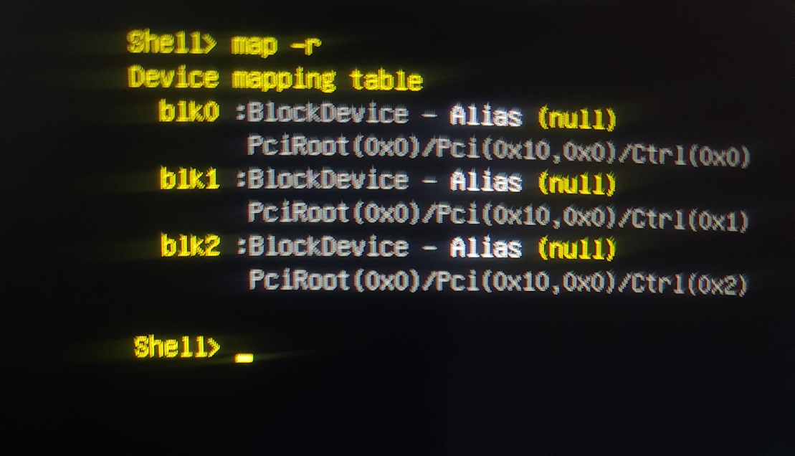

# 第一章：修复与重生

一切都始于一次失败的操作系统（Brunch OS）安装尝试。平板电脑在启动时既无法启动 Windows，也无法继续安装；它不断地进入“自动修复”循环，或者直接进入 UEFI Shell 界面。设备在软件层面已经“变砖”，成了一个没有功能的废品。

## 故障诊断：基于证据的系统化方法

为了找到问题的根源，我采用了一种简单而有效的方法：在两个不同层面上测试硬件，即操作系统内核和设备自身的固件。

| **第一级：使用 Linux 内核进行硬件测试** | **第二级：使用 UEFI 固件进行设备测试** |
| :---: | :---: |
|当我用一个 Linux Mint Live USB 启动系统时，`GParted` 应用程序顺利地识别了平板电脑的 64GB eMMC 存储。我可以在上面进行分区和格式化。这是存储芯片物理上完好无损的明确证据。 | 而在 UEFI Shell 界面中，列出设备的 `map -r` 命令却没有显示任何与 eMMC 存储单元相关的条目（`blkX`）。这表明，作为平板电脑大脑的 UEFI，在硬件层面上无法识别物理上完好的存储器。 |
|  |  |
| *GParted 显示 eMMC 芯片是正常的。问题不在硬件。* | *`map -r` 命令证明了 UEFI 看不到同一块存储器。* |

**最终诊断：** 这两个测试的结果看似矛盾，但实际上精确地指出了问题所在：问题不在于 eMMC 芯片本身，而在于 UEFI 固件或 NVRAM 中的配置损坏。失败的安装破坏了设备识别自身硬件的软件层。

## 解决方案：克服单端口的限制

当我带着这些明确的证据联系 Wortmann AG 技术支持时，他们确认这是一个已知问题，解决方法是重新刷写 BIOS。他们分享了所需的 BIOS 文件和说明。

但当时存在一个严重的硬件限制：设备上**只有一个 USB 端口**。刷写过程需要同时连接一个用于输入命令的 USB 键盘和一个存放文件的 U 盘。

为了解决这个问题，我设计了以下步骤的方法：

1.  **将命令存入内存：** 首先插入 USB 键盘。在 EFI Shell 中输入 `Flash.nsh` 命令并按下回车键（不用管它是否报错）。这将命令保存到 Shell 的临时历史记录中。
2.  **更换设备：** 拔下键盘，插入存有 BIOS 文件的 U 盘。
3.  **调用命令：** 在没有键盘的情况下，使用平板电脑的物理**音量增/减键**在命令历史中导航。当 `Flash.nsh` 命令再次出现在屏幕上时，按一次**电源键**（相当于回车键）来执行命令。

通过这种非传统的方法，刷写过程成功完成，平板电脑的大脑重新识别了它遗忘的存储器。通过这次操作，设备从昏迷中苏醒，重获新生。

### 所需文件

*   **Terra Pad 1062 BIOS 文件：** 您可以通过以下链接获取制造商提供的 BIOS 刷写文件。
    *   [TERRAPAD1062_BIOS_FLASH.zip 下载链接](https://github.com/semsyekeler/hardware-hacking-terrapad1062-windows-tablet/raw/refs/heads/main/TERRAPAD1062_BIOS_FLASH.zip)
    *   **警告：** BIOS 更新是一项有风险的操作。使用此文件的所有责任由您自己承担。请确保在操作过程中设备电源不会中断。

---
**[下一章：硬件演进 →](./2_硬件演进.md)**