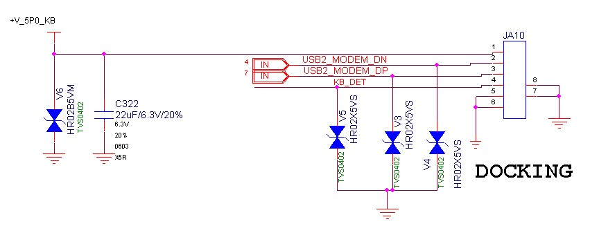
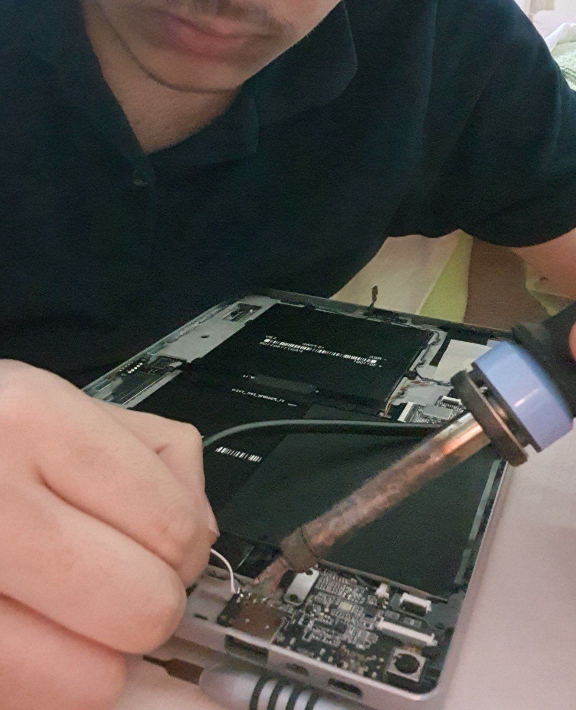

# 第二章：硬件演进

本章详细介绍了使设备超越其标准功能的硬件改造和改进。

## 逆向工程：Docking Port（扩展坞接口）分析

*   **目的：** 分析位于平板电脑底部的、为原装键盘设计的5针磁性 **Pogo-Pin 连接器**，并将其改造成一个功能性端口。
*   **方法：** 通过制造商提供的技术原理图（图1）和使用万用表进行的测量，验证了引脚结构。基于此验证，我创建了自己的连接图（图2）。分析显示，该端口包含一个功能齐全的 USB 2.0 接口。
*   **结果：** 利用获得的信息，制作了一个为设备增加外部 USB-A 端口的专用适配器。适配器设计得与平板电脑的内部凹槽完美贴合，保持了人体工程学的完整性。

  
  

  <i>图1：制造商提供的原始原理图。 &nbsp;&nbsp;&nbsp;&nbsp; 图2：经我测量验证的引脚结构。（正面为屏幕，背面为后盖）</i>

### 引脚编号和功能

分析后得到的引脚配置如下：

| 引脚编号 | 功能                | 原理图对应 | 说明                                                                |
| :----------: | ------------------- | :------------: | ----------------------------------------------------------------------- |
| **1**        | **+5V 电源**         |  `+V_5P0_KB`   | 为外部配件供电。符合 USB 标准。             |
| **2**        | **USB Data - (DN)** | `USB2_MODEM_DN`| 标准 USB 2.0 负数据线。                                    |
| **3**        | **USB Data + (DP)** | `USB2_MODEM_DP`| 标准 USB 2.0 正数据线。                                    |
| **4**        | **键盘检测** |    `KB_DET`    | 检测键盘是否插入。由外部键盘通过一个 **1k Ohm 电阻** 连接到 GND（引脚5）来激活。 |
| **5**        | **地线 (GND)**    |     `GND`      | 电路的公共参考地线。                                   |

  

  <i>根据逆向工程获得的信息设计的专用 USB 插座。</i>

## 开始改造前：拆开外壳

**警告：** 这些操作需要经验。您可能会对设备造成永久性损坏并使保修失效。所有责任由您自己承担。

*   **所需工具：**
    *   Torx T4 螺丝刀头
    *   塑料拨片或类似旧银行卡的薄而柔韧的撬具

*   **拆卸说明：**
    1.  **拆下正确的螺丝：** 拆下后盖上的**所有螺丝**。这些是支架上的黑色螺丝和底部的白色/银色螺丝。
    2.  **关键警告：** **绝对不要**动支架直接连接到平板金属外壳的铰链螺丝！拆卸这些螺丝会使设备组装变得困难，而且是不必要的操作。
    3.  **分离后盖：** 拆下所有螺丝后，小心地将塑料拨片插入外壳和后盖之间，然后慢慢撬开卡扣以分离后盖。

  

  <i>拆卸过程：支架铰链上的螺丝（3x2颗黑色）及其下方的螺丝（4颗银色）需要被拆下。</i>

*   **组装提示：**
    *   在安装靠近磁铁部分的底部螺丝时，由于磁力吸引，螺丝可能会从孔位滑脱。您可能需要用手指辅助对齐螺丝。
    *   请极其小心地对待带状电缆（Ribbon Cable）；它们很容易断裂。
    *   操作时，注意不要让螺丝或金属工具接触到主板上的 SMD 元件，以免造成短路。

## 改造一：音响系统升级

*   **问题：** 设备的原始扬声器声音单薄尖锐，尤其是在播放含有人声的内容时。
*   **解决方案：** 将从一台旧笔记本电脑上拆下的、带有独立声腔的更高质量的一对扬声器，焊接到平板电脑的原始扬声器输出端。
*   **工程细节：** 扬声器线缆穿过平板电脑原始的扬声器格栅。扬声器的位置经过精心安排，以完美贴合外壳的几何形状，从而保持了设备的人体工程学和物理完整性。最终，音质得到了显著提升。

  

  <i>安装旧笔记本电脑的扬声器。</i>

## 改造二：解决“幽灵键盘”问题

*   **问题：** 定制的 USB 插座的金属引脚与平板电脑的铝制机身接触，导致 `KB_DET`（键盘检测）引脚被意外触发，这会锁定屏幕自动旋转等功能。虽然拆装电池可以暂时解决问题，但只要接触持续，错误就会重现。
*   **解决方案：** 使用绝缘的热熔胶对接触区域进行电气隔离，永久性地解决了问题。

## 其他机械改进

*   **更换摄像头镜头：** 将有划痕的原始摄像头镜头，替换为从一台旧笔记本电脑上小心拆下的完好镜头。保留了镜头的原始粘合剂进行安装。
*   **消除机身吱嘎声：** 在外壳易弯曲的部位从内部增加了支撑件，以防止内陷，从而增加了机械稳定性并完全消除了吱嘎声。

  

  <i>所有改造完成后平板电脑的内部布局。</i>

---
**[← 上一章：修复与重生](./1_修复与重生.md) | [下一章：软件与优化 →](./3_软件与优化.md)**