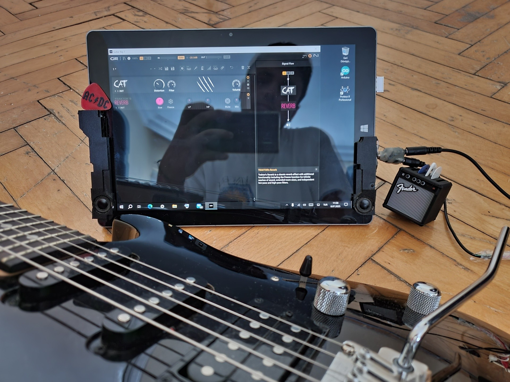

# Terra Pad 1062：一个硬件回收与改造项目

**语言**

<a href="../../README.md">🇺🇸 English</a> | <a href="../tr/README.md">🇹🇷 Türkçe</a> | <a href="../de/README.md">🇩🇪 Deutsch</a> | <a href="../es/README.md">🇪🇸 Español</a> | <a href="../fr/README.md">🇫🇷 Français</a> | <a href="../ru/README.md">🇷🇺 Русский</a> | 🇨🇳 中文

  

| **项目摘要** |
| :---: |
| 本项目记录了一台闲置的 Windows 平板电脑如何通过硬件和软件层面的修复与改造，转变为一台多功能、便携且高性价比的设备。最终成果是一台比市面上许多小众产品功能更强大的个人工作站，它能完美执行**办公、网页浏览、PDF 阅读/编辑和媒体消费**等日常任务，同时也能胜任**吉他效果处理器**和**移动工程站**等特殊任务。 |

这个代码库逐步记录了一台因软件错误而无法使用的 Terra Pad 1062 平板电脑，通过系统的故障诊断、修复以及一系列硬件/软件改造，转变为一台现代、多功能设备的全过程。

本指南旨在为拥有类似设备或对硬件改造项目感兴趣的人士提供技术参考。

**警告：** 本指南中的操作需要知识和经验。您可能会对设备造成永久性损坏并使保修失效。所有责任由您自己承担。

---

## 项目大纲

本项目由5个主要部分组成，讲述了一台设备的重生故事：

### **[第一章：修复与重生](./1_修复与重生.md)**
通过基于证据的诊断，找出导致设备无法使用的 UEFI/BIOS 错误，并在只有一个 USB 端口的限制下重新刷写 BIOS。

### **[第二章：硬件演进](./2_硬件演进.md)**
通过逆向工程将设备原始的5针 Pogo-Pin 端口改造为 USB 端口，升级音响系统，以及进行其他机械改进。

### **[第三章：软件与优化](./3_软件与优化.md)**
在经历了 Linux 的探索后，最终决定使用 Windows 10，并选择了关键的软件，以在低功耗硬件上实现流畅体验。

### **[第四章：超越极限 - 新功能](./4_超越极限.md)**
修复后的平板电脑变身为多种工具：
*   **便携办公室：** 流畅处理电子邮件、阅读/编辑 PDF 和网页浏览。
*   **媒体中心：** 凭借高质量屏幕和升级的音响系统，提供绝佳的电影/剧集观看体验。
*   **便携式第二屏幕：** 使用 Space Desk 作为无线编程显示器。
*   **吉他放大器处理器：** 使用定制硬件和 FlexASIO，打造一个无延迟且成本极低的音乐工作室。
*   **移动工程站：** 一个甚至可以运行 Proteus 等重型软件的系统。

### **[第五章：总结与个人收获](./5_项目总结与收获.md)**
除了项目的技术成功之外，这次旅程在我的问题解决能力、视角和项目文档记录规范方面带来的价值。

---

## 致谢

感谢 Wortmann AG 的 **Dennis Sudermann** 在项目初期提供的宝贵帮助。