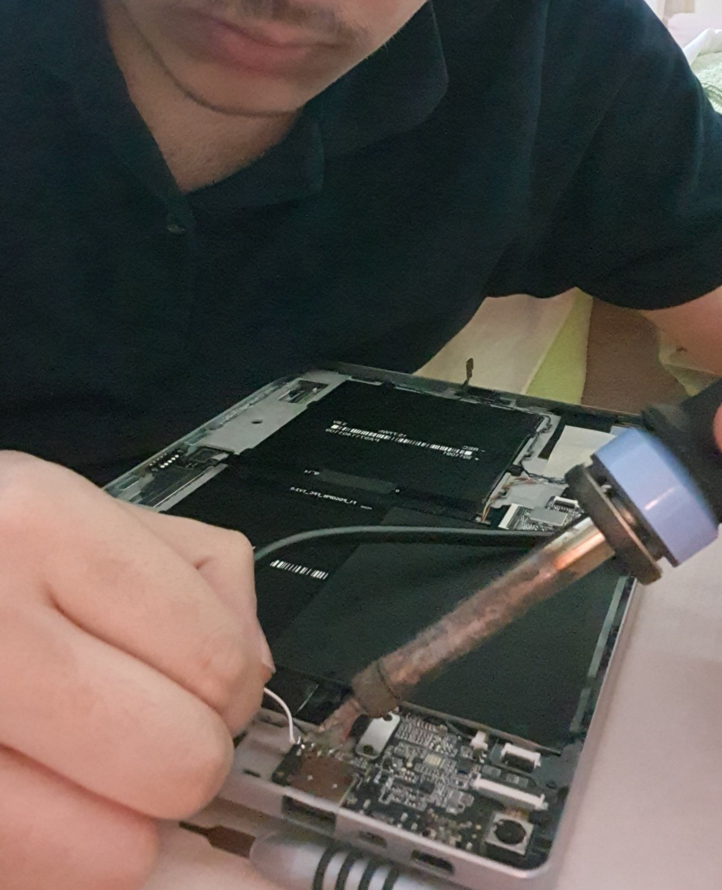

# Kapitel II: Hardware-Evolution

In diesem Kapitel werden die Hardware-Modifikationen und -Verbesserungen detailliert beschrieben, die es ermöglichten, die Fähigkeiten des Geräts über den Standard hinauszuführen.

## Reverse Engineering: Analyse des Docking-Ports

*   **Ziel:** Analyse des 5-Pin-Magnet-**Pogo-Pin-Anschlusses** an der Unterseite des Tablets, der für die Originaltastatur konzipiert war, um ihn in einen funktionalen Port umzuwandeln.
*   **Methode:** Die Pinbelegung wurde mithilfe eines vom Hersteller bereitgestellten technischen Schemas (Foto 1) und Messungen mit einem Multimeter überprüft. Basierend auf dieser Überprüfung erstellte ich mein eigenes Anschlussschema (Foto 2). Die Analyse ergab, dass der Port eine voll funktionsfähige USB-2.0-Schnittstelle beherbergt.
*   **Ergebnis:** Mit den gewonnenen Informationen wurde ein spezieller Adapter hergestellt, der dem Gerät einen externen USB-A-Port hinzufügt. Der Adapter wurde so konzipiert, dass er perfekt in die innere Aussparung des Tablets passt, wodurch die ergonomische Integrität erhalten blieb.

  
  

  <i>Foto 1: Originalschema des Herstellers. &nbsp;&nbsp;&nbsp;&nbsp; Foto 2: Von mir durch eigene Messungen verifizierte Pinbelegung. (Vorderseite Bildschirm, Rückseite Gehäuse)</i>

### Pin-Nummerierung und Funktionen

Die aus der Analyse resultierende Pin-Konfiguration ist wie folgt:

| Pin-Nummer | Funktion              | Schema-Entsprechung | Beschreibung                                                              |
| :--------: | --------------------- | :-----------------: | ------------------------------------------------------------------------- |
| **1**      | **+5V Strom**         | `+V_5P0_KB`         | Versorgt externes Zubehör mit Strom. Entspricht den USB-Standards.        |
| **2**      | **USB Data - (DN)**   | `USB2_MODEM_DN`     | Standard-USB-2.0-negative-Datenleitung.                                   |
| **3**      | **USB Data + (DP)**   | `USB2_MODEM_DP`     | Standard-USB-2.0-positive-Datenleitung.                                   |
| **4**      | **Tastaturerkennung** | `KB_DET`            | Erkennt, ob eine Tastatur angeschlossen ist. Wird von der externen Tastatur durch einen **1k Ohm Widerstand** gegen GND (Pin 5) gezogen, um aktiv zu werden. |
| **5**      | **Masse (GND)**       | `GND`               | Gemeinsame Referenzmasse für den Schaltkreis.                             |

  

  <i>Die spezielle USB-Buchse, die auf der Grundlage der durch Reverse Engineering gewonnenen Informationen entwickelt wurde.</i>

## Vor den Modifikationen: Öffnen des Gehäuses

**WARNUNG:** Diese Vorgänge erfordern Erfahrung. Sie können Ihr Gerät dauerhaft beschädigen und die Garantie erlöschen lassen. Die gesamte Verantwortung liegt bei Ihnen.

*   **Benötigte Werkzeuge:**
    *   Torx T4 Schraubendreher-Bit
    *   Ein dünnes und flexibles Hebelwerkzeug wie ein Plastik-Plektrum oder eine alte Bankkarte

*   **Demontageanleitung:**
    1.  **Die richtigen Schrauben entfernen:** Entfernen Sie **alle Schrauben** auf der Rückseite. Dies sind die schwarzen Schrauben am Kickstand und die weißen/silbernen Schrauben an der Unterseite.
    2.  **WICHTIGER HINWEIS:** Berühren Sie **auf keinen Fall** die Scharnierschrauben, die den Kickstand direkt mit dem Metallgehäuse des Tablets verbinden! Das Entfernen dieser Schrauben erschwert den Zusammenbau des Geräts und ist ein unnötiger Schritt.
    3.  **Deckel abnehmen:** Nachdem alle Schrauben entfernt sind, führen Sie das Plastik-Plektrum vorsichtig zwischen Gehäuse und Rückdeckel ein und lösen Sie die Clips, um den Deckel langsam abzunehmen.

  

  <i>Demontage: Die Schrauben, die den Kickstand mit dem Scharnier verbinden (3x2 schwarze) und die darunter liegenden (4 silberne) müssen entfernt werden.</i>

*   **Montagetipps:**
    *   Beim Einsetzen der unteren Schrauben in der Nähe der magnetischen Teile kann die Schraube aufgrund der magnetischen Anziehung aus dem Gewinde rutschen. Möglicherweise müssen Sie die Schraube mit dem Finger führen, um sie auszurichten.
    *   Behandeln Sie Flachbandkabel (Ribbon-Kabel) äußerst vorsichtig; sie können leicht reißen.
    *   Achten Sie darauf, dass Schrauben oder Metallwerkzeuge keine SMD-Komponenten auf dem Mainboard berühren und einen Kurzschluss verursachen.

## Modifikation 1: Upgrade des Audiosystems

*   **Problem:** Die Originallautsprecher des Geräts hatten einen unzureichenden und blechernen Klang, insbesondere bei sprachlastigen Inhalten.
*   **Lösung:** Ein Paar hochwertigere Lautsprecher mit eigenen Akustikkammern aus einem alten Laptop wurden an die originalen Lautsprecherausgänge des Tablets gelötet.
*   **Technische Details:** Die Lautsprecherkabel wurden durch die originalen Lautsprechergitter des Tablets geführt. Die Lautsprecher wurden so positioniert, dass sie sich perfekt in die Gehäusegeometrie einfügen, wodurch die Ergonomie und die physische Integrität des Geräts erhalten blieben. Das Ergebnis war eine deutliche Verbesserung der Klangqualität.

  

  <i>Montage des alten Laptop-Lautsprechers.</i>

## Modifikation 2: Lösung des "Geister-Tastatur"-Problems

*   **Problem:** Die Metallstifte der speziellen USB-Buchse berührten das Aluminiumgehäuse des Tablets, wodurch der `KB_DET` (Tastaturerkennungs)-Pin unbeabsichtigt ausgelöst wurde. Dies blockierte Funktionen wie die automatische Bildschirmdrehung. Das Ab- und Wiederanschließen des Akkus löste das Problem nur vorübergehend, da der Kontakt bestehen blieb und der Fehler erneut auftrat.
*   **Lösung:** Der Kontaktbereich wurde mit isolierendem Heißkleber elektrisch isoliert, wodurch das Problem dauerhaft behoben wurde.

## Weitere mechanische Verbesserungen

*   **Austausch der Kameralinse:** Die zerkratzte Original-Kameralinse wurde durch eine intakte Linse ersetzt, die vorsichtig aus dem zerbrochenen Gehäuse eines alten Laptops ausgebaut wurde. Die Montage erfolgte unter Beibehaltung des Originalklebers der Linse.
*   **Beseitigung von Gehäuseknarzen:** An den flexiblen Stellen des Gehäuses wurden von innen Stützteile angebracht, um ein Nachgeben zu verhindern. Dadurch wurde die mechanische Stabilität erhöht und das Knarzen vollständig beseitigt.

  

  <i>Die innere Anordnung des Tablets nach Abschluss aller Modifikationen.</i>

---
**[← Vorheriges Kapitel: Reparatur und Wiederbelebung](./1_Reparatur_und_Wiederbelebung.md) | [Nächstes Kapitel: Software und Optimierung →](./3_Software_und_Optimierung.md)**