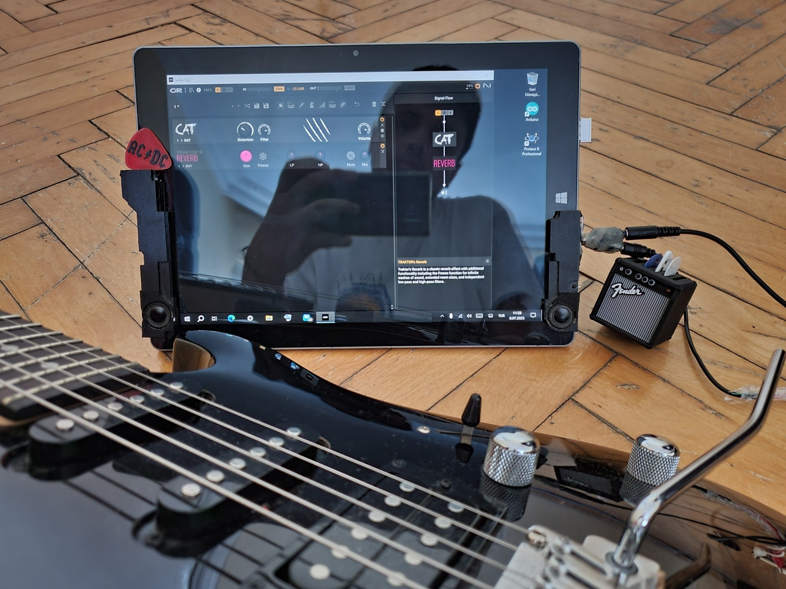

# Terra Pad 1062: Ein Hardware-Recycling- und Modifikationsprojekt

**Sprachen**

<a href="../../README.md">🇺🇸 English</a> | <a href="../tr/README.md">🇹🇷 Türkçe</a> | 🇩🇪 Deutsch | <a href="../es/README.md">🇪🇸 Español</a> | <a href="../fr/README.md">🇫🇷 Français</a> | <a href="../ru/README.md">🇷🇺 Русский</a> | <a href="../cn/README.md">🇨🇳 中文</a>

  

| **Projektübersicht** |
| :---: |
| Dieses Projekt dokumentiert, wie ein ausgemustertes Windows-Tablet repariert und auf Hardware- sowie Softwareebene modifiziert wurde, um es in ein vielseitiges, tragbares und kostengünstiges Gerät zu verwandeln. Das Ergebnis ist eine persönliche Workstation, die leistungsfähiger ist als viele Nischenprodukte auf dem Markt. Sie bewältigt alltägliche Aufgaben wie **Büroarbeiten, Surfen im Web, Lesen/Bearbeiten von PDFs und Medienkonsum** perfekt und übernimmt gleichzeitig spezielle Aufgaben wie die eines **Gitarrenprozessors** und einer **mobilen Engineering-Station**. |

Dieses Repository dokumentiert Schritt für Schritt den Prozess, wie ein Terra Pad 1062 Tablet, das aufgrund eines Softwarefehlers unbrauchbar geworden war, durch systematische Fehlerdiagnose, Reparatur und eine Reihe von Hardware- und Software-Modifikationen in ein modernes, vielseitiges Gerät verwandelt wurde.

Diese Anleitung dient als technische Referenz für Personen, die ähnliche Geräte besitzen oder sich für Hardware-Modifikationsprojekte interessieren.

**WARNUNG:** Die in dieser Anleitung beschriebenen Vorgänge erfordern Kenntnisse und Erfahrung. Sie können Ihr Gerät dauerhaft beschädigen und die Garantie erlöschen lassen. Die gesamte Verantwortung liegt bei Ihnen.

---

## Gliederung des Projekts

Dieses Projekt besteht aus 5 Hauptkapiteln, die die Wiedergeburt eines Geräts beschreiben:

### **[Kapitel I: Reparatur und Wiederbelebung](./1_Reparatur_und_Wiederbelebung.md)**
Beweisgestützte Diagnose des UEFI/BIOS-Fehlers, der das Gerät unbrauchbar machte, und das Neuflashen des BIOS unter der Einschränkung eines einzigen USB-Ports.

### **[Kapitel II: Hardware-Evolution](./2_Hardware_Evolution.md)**
Reverse Engineering des originalen 5-Pin-Pogo-Pin-Ports des Geräts zu einem vollwertigen USB-Port, Aufrüstung des Audiosystems und andere mechanische Verbesserungen.

### **[Kapitel III: Software und Optimierung](./3_Software_und_Optimierung.md)**
Die Entscheidung für Windows 10 nach Linux-Abenteuern und die Auswahl kritischer Software, die auch auf leistungsschwacher Hardware ein flüssiges Erlebnis ermöglicht.

### **[Kapitel IV: Jenseits der Grenzen - Neue Fähigkeiten](./4_Jenseits_der_Grenzen_Neue_Faehigkeiten.md)**
Die Werkzeuge, in die sich das reparierte Tablet verwandelt hat:
*   **Mobiles Büro:** E-Mail, PDF-Lesen/-Bearbeiten und flüssiges Surfen im Web.
*   **Medienzentrum:** Perfektes Film-/Serienerlebnis dank hochwertigem Display und aufgerüstetem Soundsystem.
*   **Tragbarer Zweitmonitor:** Ein kabelloser Coding-Monitor mit Space Desk.
*   **Gitarrenverstärker-Prozessor:** Ein latenzfreies und weitaus günstigeres Musikstudio mit spezieller Hardware und FlexASIO.
*   **Mobile Engineering-Station:** Ein System, das sogar anspruchsvolle Software wie Proteus ausführen kann.

### **[Kapitel V: Fazit und Erkenntnisse](./5_Fazit_und_Erkenntnisse.md)**
Über den technischen Erfolg des Projekts hinaus, der Wert, den diese Reise meinen Fähigkeiten zur Problemlösung, meiner Perspektive und meiner Disziplin zur Projektdokumentation hinzugefügt hat.

---

## Danksagung

Vielen Dank an **Dennis Sudermann** von der Wortmann AG für seine wertvolle Hilfe zu Beginn dieses Projekts.