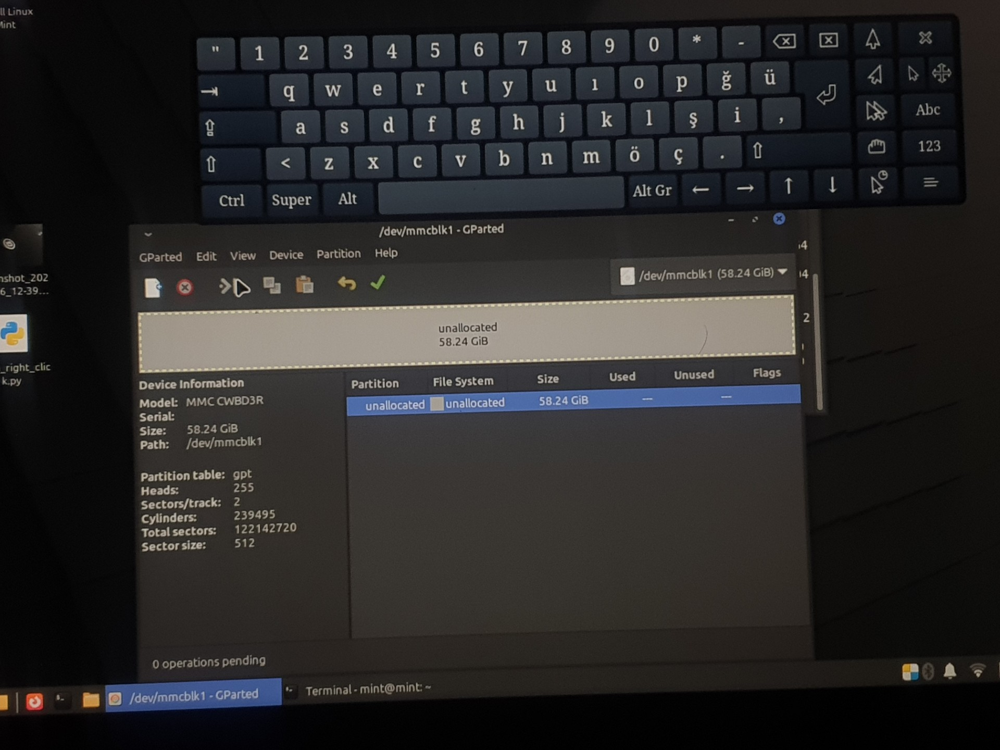
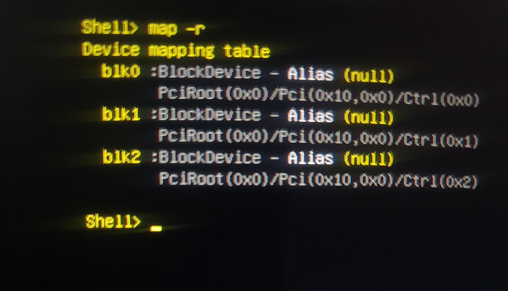

# Chapter I: Repair and Resurrection

It all began after a failed attempt to install an operating system (Brunch OS). The tablet could neither boot into Windows nor continue with the installation; it was stuck in an "Automatic Repair" loop or would drop directly to the UEFI Shell screen. The device was software-bricked and rendered useless.

## Fault Diagnosis: A Systematic, Evidence-Based Approach

To find the root of the problem, I followed a simple yet effective method: testing the hardware at two different levels—the operating system kernel and the device's own firmware.

| **Level 1: Hardware Test with Linux Kernel** | **Level 2: Device Test with UEFI Firmware** |
| :---: | :---: |
| When I booted the system with a Linux Mint Live USB, the `GParted` application recognized the tablet's 64GB eMMC storage without any issues. I could partition and format it. This was clear and definitive proof that the storage chip was physically intact. | On the UEFI Shell screen, however, the `map -r` command, which lists devices, showed no entry (`blkX`) for the eMMC storage unit. This revealed that the tablet's own brain, the UEFI, could not recognize the physically sound memory at the hardware level. |
|  |  |
| *GParted said the eMMC chip was alive. The problem wasn't hardware-related.* | *The `map -r` command proved that the UEFI couldn't see the same memory.* |

**Final Diagnosis:** While these two tests might seem contradictory, they actually pinpointed the problem precisely: The issue was not with the eMMC chip itself, but with a corruption in the UEFI firmware or its NVRAM configuration. The failed installation had broken the software layer responsible for the device's own hardware recognition.

## The Solution: Overcoming the Single-Port Limitation

When I presented this clear evidence to Wortmann AG's technical support, they confirmed that it was a known issue and the solution was to re-flash the BIOS. They provided the necessary BIOS file and instructions.

However, there was a significant hardware constraint: the device had **only one USB port**. The flashing process required both a USB keyboard to type commands and a USB flash drive to hold the files, simultaneously.

To overcome this problem, I developed the following method:

1.  **Load the Command into Memory:** First, I plugged in the USB keyboard. I typed the `Flash.nsh` command into the EFI Shell and pressed Enter (ignoring the error it produced). This saved the command in the Shell's temporary history.
2.  **Swap the Devices:** I unplugged the keyboard and plugged in the USB flash drive containing the BIOS files.
3.  **Recall the Command:** Without a keyboard, I used the tablet's physical **Volume Up/Down buttons** to navigate through the command history. When the `Flash.nsh` command reappeared on the screen, I pressed the **Power Button** once (which acts as Enter) to execute the command.

Thanks to this unconventional method, the flashing process was completed successfully, and the tablet's brain recognized its forgotten memory once again. The device came out of its coma and was brought back to life.

### Required Files

*   **Terra Pad 1062 BIOS File:** You can access the BIOS flash file provided by the manufacturer via the link below.
    *   [Download Link for TERRAPAD1062_BIOS_FLASH.zip](https://github.com/semsyekeler/hardware-hacking-terrapad1062-windows-tablet/raw/refs/heads/main/TERRAPAD1062_BIOS_FLASH.zip)
    *   **Warning:** A BIOS update is a risky procedure. You are solely responsible for using this file. Ensure the device is connected to a power source during the process.

---
**[Next Chapter: Hardware Evolution →](./2_Hardware_Evolution.md)**
