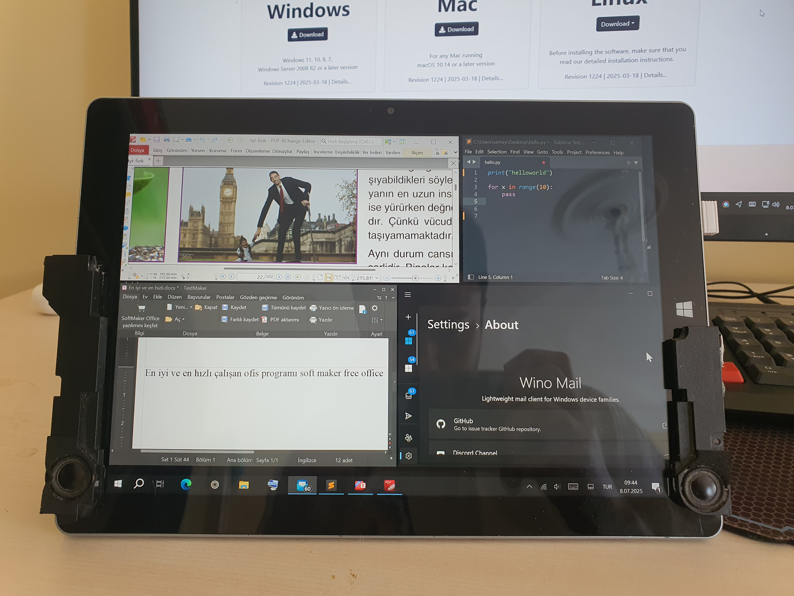
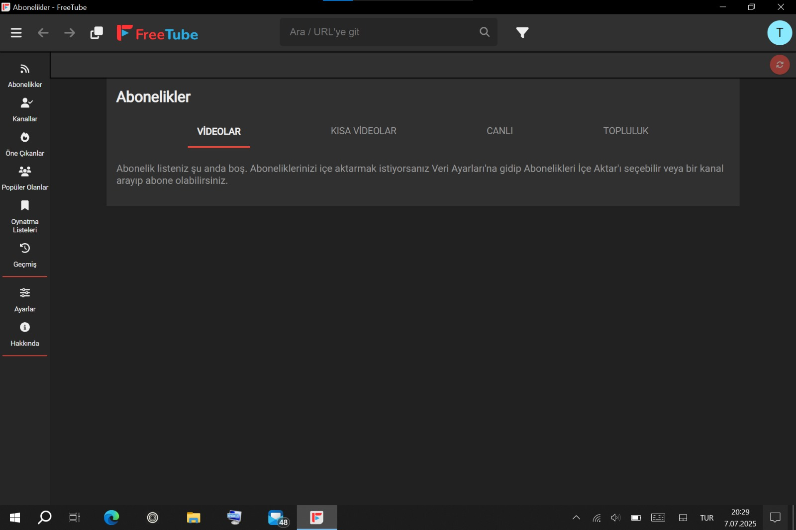

# Capítulo III: Software y Optimización

Una vez completadas las modificaciones de hardware, el siguiente paso era establecer el ecosistema de software más adecuado para este hardware y convertirlo en una estación de trabajo eficiente.

## A. La Búsqueda del Sistema Operativo: Una Aventura Desafiante

*   **Problema:** Un procesador de baja potencia como el Intel Atom Z8500 puede tener dificultades con los sistemas operativos modernos. Mi objetivo era encontrar el sistema que ofreciera la experiencia más fluida tanto para el consumo de medios como para la productividad.
*   **Experimentos y Resultados:**
    *   **Aventura con Ubuntu:** Durante la instalación, la pantalla se apagaba constantemente en momentos aleatorios, lo que no solo interrumpió el proceso de instalación, sino que también demostró que un uso estable sería imposible.
    *   **Intento con Debian (Net Install):** Con el objetivo de tener un sistema de arranque dual, realicé la instalación más mínima posible de Debian. Mi meta era crear un entorno Linux ultraligero para el consumo de medios. Sin embargo, el resultado fue una experiencia extremadamente lenta, torpe y alejada de las capacidades de hardware de la tableta en comparación con Windows 10, convirtiéndose en una auténtica tortura.
*   **Decisión Final:** Las pruebas confirmaron que para esta combinación específica de hardware, la plataforma más estable, compatible y con mejor rendimiento era **Windows 10**. La integración perfecta de los controladores de la pantalla táctil, el lápiz y los sensores fue el factor decisivo.

  

  <i>Solo uno de los innumerables intentos en el mundo de Linux. Cada distribución presentó un desafío diferente en cuanto a la compatibilidad del hardware.</i>

## B. Elecciones Críticas de Software: Velocidad y Estabilidad

El software que funcionó mejor en este hardware y transformó la tableta en una verdadera estación de trabajo portátil, proporcionando **arranque rápido y uso estable**, fue el siguiente:

| Categoría | Software Seleccionado | Descripción y Enlace de Descarga |
| :--- | :--- | :--- |
| **Teclado en Pantalla**| **Comfort On-Screen Keyboard Pro** | Una alternativa profesional que reemplaza el lento teclado integrado de Windows. Se abre al instante, funciona sin lag, y su capacidad para aparecer automáticamente al hacer clic en campos de texto, moverse a cualquier lugar y **redimensionarse dinámicamente** hace que el uso de la tableta sea increíblemente fluido.   *[Sitio Web Oficial](https://www.comfort-software.com/)* |
| **Programación** | **Sublime Text** | Su estructura increíblemente ligera le permite abrirse al instante y ofrecer un uso fluido sin tartamudeos, incluso con los archivos de código más grandes.   *[Sitio Web Oficial](https://www.sublimetext.com/)* |
| **PDF** | **PDF-XChange Editor** | A diferencia de alternativas pesadas como Adobe Reader, se abre muy rápidamente y ofrece un rendimiento estable sin tirones, incluso al navegar por archivos PDF de gran tamaño.   *[Sitio Web Oficial](https://www.tracker-software.com/product/pdf-xchange-editor)* |
| **Oficina** | **SoftMaker FreeOffice** | La alternativa más rápida y ligera a Microsoft Office. Abre y edita archivos de Word, Excel y PowerPoint con una velocidad sorprendente.   *[Sitio Web Oficial](https://www.freeoffice.com/es/)* |
| **Correo**| **Wino Mail** | Combina una interfaz moderna y limpia con una estructura ligera que no consume recursos del sistema.   *[Microsoft Store](https://apps.microsoft.com/detail/9ncrcvjc50wl?hl=es-es&gl=es)* |
| **Escritorio Remoto**| **Parsec** | Su tecnología de baja latencia te permite conectarte de forma remota a tu ordenador principal y realizar incluso tareas pesadas de forma fluida desde esta tableta.   *[Sitio Web Oficial](https://parsec.app/)* |

  

  <i>Software ligero y potente que desata el potencial del dispositivo.</i>

## C. Optimizaciones para el Uso Diario

| Problema de YouTube y su Solución | Solución de OneNote y el Lápiz |
| :---: | :---: |
|  |  |
| **Problema:** Ver YouTube desde el navegador significaba tirones constantes y desincronización de audio/video.    **Solución:** Se instaló el cliente **[FreeTube](https://freetubeapp.io/)**, que evita el navegador. Esta única aplicación transformó por completo la capacidad de consumo de medios de la tableta, proporcionando una experiencia fluida, sin anuncios y sin interrupciones. | **Problema:** Falta de una aplicación fluida para tomar notas y de un lápiz.    **Solución:** Se combinó la versión más rápida, `OneNote for Windows 10` (de la Microsoft Store), con la aplicación **[VirtualTablet](https://www.sunnysidesoft.com/virtualtablet/)**. VirtualTablet conecta el teléfono a la PC como una tableta gráfica, permitiéndome usar el lápiz del teléfono en OneNote. |

### Optimización del Navegador y Consejos para la Pantalla Táctil
*   **El Navegador Más Rápido:** En la búsqueda del mejor navegador para este hardware, probé todas las alternativas populares. Las pruebas concluyeron que el navegador que consumía menos recursos del sistema y ofrecía el rendimiento más fluido era **Microsoft Edge**.
*   **Consumo General de Medios:** Aparte de YouTube, el dispositivo no presenta problemas al reproducir videos, como ver películas o series, a través del navegador. El navegador Edge optimizado puede reproducir este tipo de contenido de manera fluida.
*   **Problema Crítico Táctil en Navegadores Basados en Chromium y su Solución:**
    *   **Problema:** En navegadores como Chrome y Brave, al tocar el botón de "abrir nueva pestaña" (+), el sistema interpretaba incorrectamente la posición precisa del toque y actuaba como si se hubiera presionado el botón adyacente de "cerrar pestaña" (X).
    *   **Solución:** Para superar este problema, en lugar de solo tocar el botón, es necesario **mantenerlo presionado brevemente en cada clic**. Este pequeño retraso le da al sistema tiempo suficiente para reconocer la posición correcta con precisión.

### Panel Táctil Virtual para Control Fino
*   **Problema:** Una pantalla táctil a veces puede ser insuficiente para tareas de precisión que requieren un ratón, como hacer clic en botones pequeños o seleccionar texto con exactitud.
*   **Solución:** Windows 10 ofrece una solución integrada. Haz clic derecho en la barra de tareas y activa la opción **"Mostrar el botón del panel táctil"**. Esto añade un icono de panel táctil a tu barra de tareas. Al hacer clic, se abre un panel táctil virtual que puedes mover a cualquier parte de la pantalla, permitiéndote controlar el cursor del ratón con precisión usando tu dedo.

Gracias a este software y a estas optimizaciones, la tableta superó todas las desventajas de su hardware y se transformó en un sistema Windows portátil totalmente funcional.

---
**[← Capítulo Anterior: Evolución del Hardware](./2_Evolucion_del_Hardware.md) | [Siguiente Capítulo: Más Allá de los Límites - Nuevas Capacidades →](./4_Mas_alla_de_los_Limites.md)**
